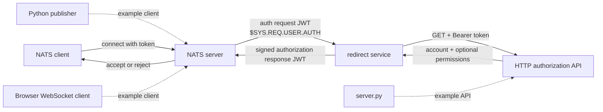

# Architecture

## Components

## Service boundaries

`main.main` loads `.env` and reads `AUTH_SERVER`. A non-empty value selects
`redirects.SetupHttpAuth`; otherwise the process prints a message and returns.
There are no other redirect implementations.

`SetupHttpAuth` adapts the HTTP endpoint to the callback accepted by
`base.Listen`. It creates a GET request, attaches the connection token as a
Bearer credential, performs the request with `http.DefaultClient`, and decodes
the JSON body into `base.ResponseData`.

`base.Listen` owns the NATS protocol:

- creates an account key pair from `ACCOUNT_SIGNER_SEED`;
- connects using `NATS_URL`;
- queue-subscribes to `$SYS.REQ.USER.AUTH` as `auth-workers`;
- decodes authorization requests;
- creates and signs user and authorization-response JWTs;
- publishes replies to the message's reply subject;
- blocks indefinitely after subscription with `select {}`.

The queue group means multiple service instances using the same group compete
for requests; one queue member receives each request delivered to that group.

## Data and trust boundaries

The NATS server creates the authorization request. The redirect service trusts
the decoded request for client/server information, but requires a non-empty
`UserNkey`. The code comment mentions a fallback to a connect-option NKey, but
the implementation does not perform that fallback.

The HTTP API decides the account audience and optional publish/subscribe
permissions returned to NATS. The service does not independently validate the
account name or permission subjects before adding them to user claims.

The account signer seed is the service's highest-value secret. It signs both
the user JWT and authorization-response JWT. Its public key must match the
issuer configured in the NATS auth callout.

## Runtime dependencies

- NATS client: `github.com/nats-io/nats.go`
- NATS JWT claims: `github.com/nats-io/jwt/v2`
- NKey signing: `github.com/nats-io/nkeys`
- `.env` loading: `github.com/joho/godotenv`
- HTTP: Go standard library

## Demonstration utilities

`server.py` always returns an `APP` account response and prints the supplied
Authorization header and Bearer token. `publish-request.py` connects with the
example username/password and publishes `hello`. The browser client connects
with a fixed development token and subscribes to `requests`.

These programs establish examples only. They do not define the production API
contract or deployment topology.

## Documentation gaps

- No automated tests exist; jCodeMunch found 12 executable symbols and no test
  reachability.
- The example API returns `perms.sub`, while the Go type expects top-level
  `pub` and `sub`.
- The intended treatment of HTTP 300 is unclear; the implementation rejects
  statuses only when `status > 300`.
- No explicit HTTP timeout, retry, circuit breaker, or response-size limit is
  implemented.
- No health/readiness endpoint or graceful shutdown path is implemented.
- Decode failures and some encoding failures publish plain JSON rather than a
  signed authorization response; NATS-side handling is not tested here.
- The connect-option NKey fallback described by a source comment is absent.
- The Docker build injects version, commit, and date linker values, but matching
  variables are not present in the indexed `main` package.
- The repository does not establish whether the account named by the HTTP API
  must already exist in NATS, though the development configuration defines
  `APP`.
