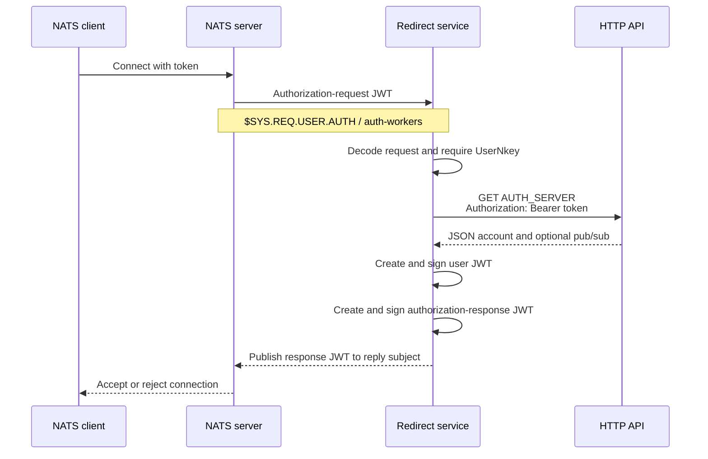

# Authentication flow

## Successful request



1. `base.Listen` connects to `NATS_URL` as `auth-validator`, with unlimited
   reconnects and a 500 ms reconnect wait.
2. It queue-subscribes to `$SYS.REQ.USER.AUTH` using `auth-workers`.
3. It decodes the message body with
   `jwt.DecodeAuthorizationRequestClaims`.
4. It requires `AuthorizationRequest.UserNkey`. Despite a nearby comment, no
   fallback to a connect-option NKey is implemented.
5. It passes `ConnectOptions.Token` to the configured listener handler.
6. `redirects.SetupHttpAuth` sends a GET to the exact `AUTH_SERVER` URL with
   `Authorization: Bearer <token>`.
7. A response status greater than 300 becomes the error `invalid token`.
   Status 300 is accepted by the implemented comparison.
8. The response body is decoded into:

   ```json
   {
     "account": "APP",
     "pub": {"allow": ["events.>"], "deny": []},
     "sub": {"allow": ["requests"], "deny": []}
   }
   ```

9. The service creates user claims for the request's user NKey. It copies the
   client name, sets the user audience to `account`, and copies non-null
   publish/subscribe permissions.
10. It signs the user JWT with `ACCOUNT_SIGNER_SEED`.
11. It creates an authorization-response claim for the user NKey, sets:
    - issuer account to the signer's public key;
    - audience to the requesting NATS server ID;
    - embedded JWT to the signed user JWT.
12. It signs that response and publishes the JWT string to the NATS message's
    reply subject.

## HTTP request example

```sh
curl \
  -H 'Authorization: Bearer <connection-token>' \
  'https://auth.example.internal/v1/nats/authorize'
```

The service sends no request body and does not add a Content-Type header.

## Failure behavior

| Failure | Observed reply |
|---|---|
| Authorization-request JWT cannot be decoded | Plain JSON `{"error":"bad_request"}` |
| Request has no `UserNkey` | Plain JSON `{"error":"missing_user_nkey"}` |
| HTTP request creation, transport, body read, JSON decode, or status > 300 fails | Signed authorization-response JWT whose `Error` contains the error text |
| User JWT encoding fails | Signed authorization-response JWT whose `Error` contains the error text |
| Error response itself cannot be encoded | Plain JSON error indicating a bad JWT response |
| Successful authorization response cannot be encoded | Plain JSON `{"error":"encode_auth_response"}` |
| Publishing the final reply fails | Failure is logged; no retry is performed |

Some publications deliberately discard their returned error. There are no
tests demonstrating how NATS treats the plain JSON replies.

## Security considerations

- The signer seed can authorize users and must be stored as a production
  secret.
- The connection token crosses the HTTP trust boundary as a Bearer credential.
- The current code logs request data, tokens, HTTP bodies, error text, and
  signed JWTs. Logs must be treated as sensitive.
- Use `tls://` or equivalent protected NATS transport and an HTTPS
  `AUTH_SERVER`; repository examples use unencrypted local connections.
- The HTTP response controls account and permissions without local
  allow-list validation.
- No explicit HTTP timeout or body-size limit is configured.
- Returning raw internal error text in signed responses may disclose details.

## Observed uncertainties

- Intended behavior for HTTP 300 is not stated.
- The example server's nested `perms` field is ignored by `ResponseData`.
- Behavior for an empty account or malformed permission subjects is untested.
- The repository contains no end-to-end assertion that NATS accepts each reply
  form.
